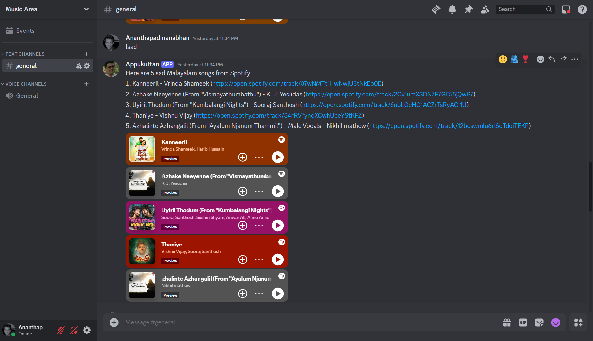
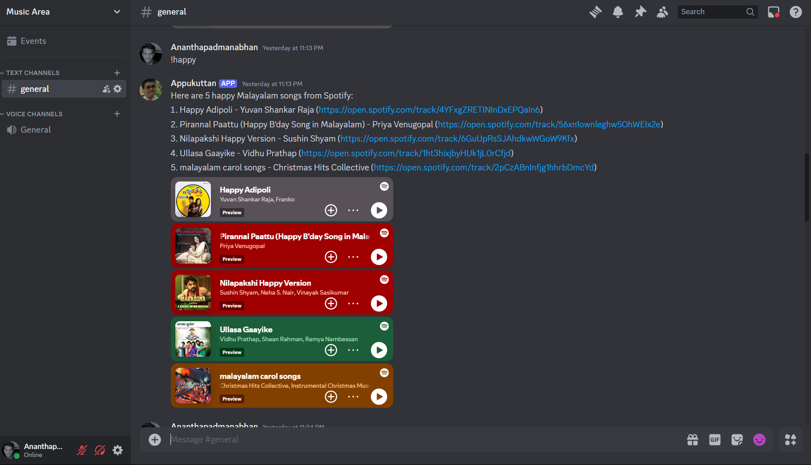
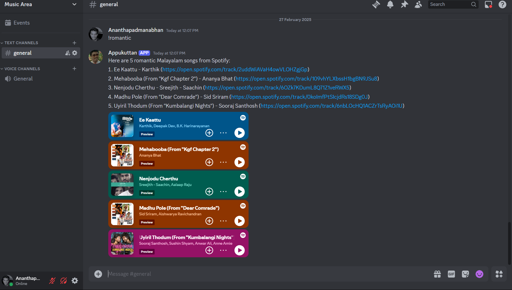

# Appukuttan: The Clueless Malayalam Music Bot! 😂🎶
Inspired by the lovable goof from In Harihar Nagar, this bot brings Malayalam music chaos to Discord—sad, happy, or romantic, just like Appukuttan’s wild life! Powered by Go and Spotify.

Say hello to Appukuttan, the Discord bot based on the In Harihar Nagar legend who’s as confused as he is charming! Like Appukuttan stumbling through sad flops, happy accidents, and romantic disasters with Maya, this bot dishes out Malayalam songs to match your mood.

## Appukuttan’s Mood Moments
Check out Appukuttan’s cinematic journey—sad, happy, and romantic—straight from In Harihar Nagar!

- ### Sad Appukuttan


The memory of his close freind sethu hits hard💔😭

- ### Happy Appukuttan


Appukuttan is happy when he is around his freinds 😁😂

- ### Romantic Appukuttan


Appukuttan is dreaming about his girl❤️🥹

## Features (Appukuttan’s Crazy Talents!)

- Suggests 5 Malayalam songs for sad, happy, or romantic moods—Appukuttan’s emotional rollercoaster!
- Hooks into Spotify (because even Appukuttan knows good music beats bad flirting).
- Free on GCP—no fees, no credit card, no Appukuttan begging for cash!
- Commands so easy even Appukuttan won’t mess them up (fingers crossed).

## Commands (Appukuttan’s Mood Swings!)

&nbsp;

| **Command** | **Description** |
| --- | --- |
| !sad | 5 sad songs to match Appukuttan’s epic fails! |
| !happy | 5 happy tracks for his rare wins—watch him dance! |
| !romantic | 5 romantic songs for his Maya dreams |
| !angry | 5 angry beats for when Appukuttan annoys you |
| !chill | 5 chill vibes to calm Appukuttan’s chaos |

## Installation & Setup (Appukuttan’s DIY Disaster!)

Appukuttan’s chilling on GCP, but if you dare to run him locally, here’s the guide (without breaking a leg):

### Prerequisites

- [Go](https://go.dev/) (1.21+—Appukuttan demands the latest, but he’ll break it anyway!)
- Discord bot token (from [Discord Developer Portal](https://discord.com/developers/docs/intro)—hide it from Appukuttan!)
- Spotify API creds (from [Spotify Developer Dashboard](https://developer.spotify.com/)—don’t let him spill them!).

### Local Setup (For the Brave!)

1. Clone the repo (if Appukuttan hasn’t lost it):

```bash
git clone https://github.com/blitzbugg/appukuttan-bot.git
cd appukuttan-bot
```

2. Grab the tools:

```bash
go get github.com/bwmarrin/discordgo
go get github.com/zmb3/spotify/v2
go mod tidy
```

3. Set secrets:

```
DISCORD_BOT_TOKEN=your_discord_bot_token_here
SPOTIFY_CLIENT_ID=your_spotify_client_id_here
SPOTIFY_CLIENT_SECRET=your_spotify_client_secret_here
```

4. Build and run (don’t let Appukuttan press Enter!):
```go
go run main.go
```

## Screenshots (Appukuttan’s Epic Fails!)

### sad



### happy



### romantic



## Made with ❤️ by Ananthapadmanabhan